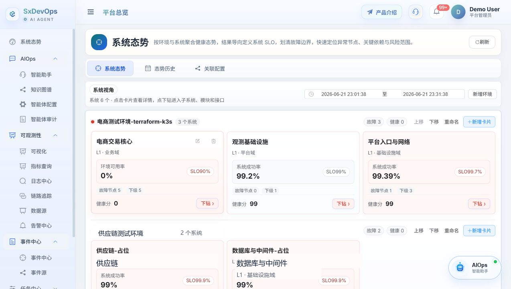
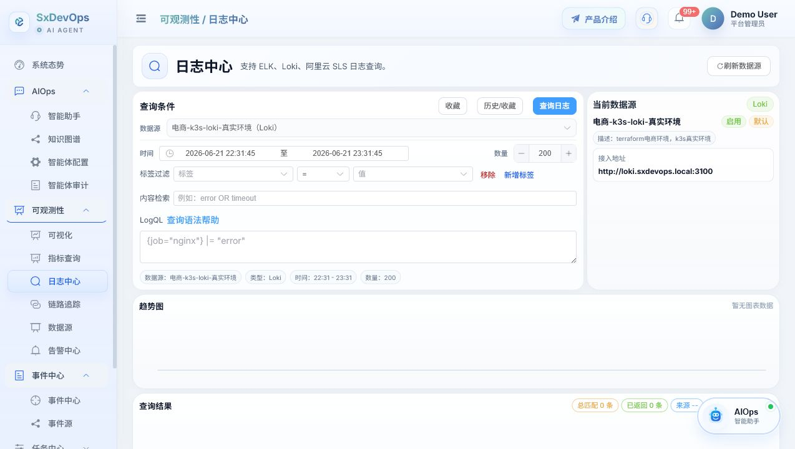
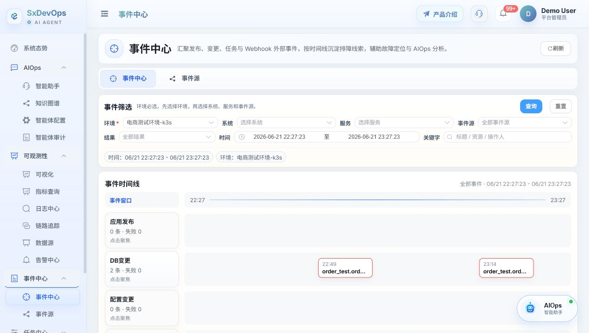
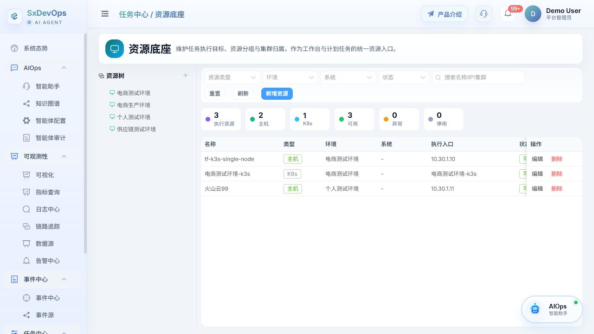

# SxDevOps 智能运维 Agent 平台

SxDevOps 是一套面向真实运维现场的智能运维 Agent 平台，基于 `Django + Django REST framework + Channels + Vue 3 + Element Plus` 构建。项目以 **AIOps、可观测性、事件中心、任务中心** 四个模块为主线，把告警、日志、链路、事件和自动化任务组织成一条可解释、可审计、可确认的处置链路。

在线体验：[https://www.sxdevops.top](https://www.sxdevops.top)

## 核心亮点

- **AIOps 智能体**：以 LLM tool-calling 为核心，通过内置 MCP 工具、Skill 模板、Action 预检和二阶段回答，把平台事实转化为可追溯的诊断结论、证据摘要和待确认动作。
- **可观测性事实层**：统一承接指标、日志、链路追踪、Grafana 看板、告警和系统态势，让智能体能按同一套事实模型完成取证、关联和解释。
- **事件中心**：沉淀告警变化、关键写操作、任务结果、发布结果和失败线索，形成可过滤、可复盘、可回放的事件现场。
- **任务中心**：承接主机巡检、批量命令、脚本模板、执行历史和任务草稿；智能体生成的动作必须经过用户确认后才进入执行链路。
- **工单系统**：提供应用发布、SQL 审计、事务工单和审批流能力，作为变更、审批和执行留痕的配套闭环。
- **容器管理**：支持 K8s 集群、工作负载、Pod 终端、ConfigMap / Secret 与 Docker 环境管理，补齐容器化运维场景。
- **权限与审计体系**：后端接口、前端路由、菜单、按钮和 WebSocket 场景均接入 RBAC；会话、工具调用、待确认动作、任务执行和关键操作都可审计。

## 产品截图

### AI Agent 与可观测性总览



### 日志与排障取证



### 事件中心



### 任务资源与执行入口



更多截图保存在 [docs/screenshots](docs/screenshots)。

## 功能模块

### AIOps

- 智能助手：支持自然语言排障、证据查询、工单汇总、任务草稿生成。
- 知识图谱：沉淀运维对象、关系、上下文和故障知识。
- 智能体配置：管理模型、MCP 工具、Skill、Action 和运行策略。
- 智能体审计：追踪会话、工具调用、模型调用、待确认动作和执行结果。

### 可观测性

- 可视化与系统态势：提供平台级状态入口和 Grafana 看板承接。
- 指标查询：面向 Prometheus 等指标源组织查询和证据包。
- 日志中心：支持日志检索、过滤、上下文定位和排障分析。
- 链路追踪：接入 Trace 数据源，辅助定位跨服务调用问题。
- 数据源管理：维护指标、日志、Trace 和关联配置。
- 告警中心：承接告警事件、告警规则和排障入口。

### 事件中心

- 事件墙：按系统、环境、应用、级别、结果和时间窗口过滤事件。
- 事件源：管理平台事件接入与事件标准化配置。
- 复盘线索：将关键结果、失败原因和操作上下文沉淀为可追溯现场。

### 任务中心

- 任务工作台：执行主机任务、脚本任务、批量命令和运维模板。
- 资源底座：维护任务执行所需的主机、资源分组和连接上下文。
- 执行审计：记录任务输入、目标范围、执行结果和失败详情。
- 计划任务：支持定时任务能力，默认按产品配置隐藏入口。

### 配套模块

- 工单系统：应用发布、SQL 审计、事务工单和审批流。
- 容器管理：K8s 集群、Pod 终端和 Docker 环境管理。
- 系统管理：用户、角色、权限、模块显示配置和操作审计。

## 技术架构

- **后端**：`Django`、`Django REST framework`、`Daphne`、`Channels`
- **前端**：`Vue 3`、`Pinia`、`Vue Router`、`Element Plus`、`ECharts`
- **数据层**：本地开发默认 `SQLite`，容器化部署默认 `MySQL`
- **缓存与实时协同**：`Redis` 用于缓存与 Channels 消息层
- **外部集成**：Kubernetes API、Docker、SSH、Prometheus / Grafana、SkyWalking、Loki / ELK / SLS

## 快速启动

### Docker Compose 一键部署

仓库已内置应用镜像、MySQL、Redis 的编排配置：

```bash
docker compose up -d --build
```

启动后访问：

- 前端与 API：`http://localhost:8000`
- MySQL、Redis 由 Compose 内部网络提供，后端默认连接 `mysql:3306` 和 `redis:6379`

首次启动容器会自动执行：

```bash
python manage.py migrate
python manage.py seed_data
python manage.py seed_templates
```

如需关闭初始化数据，可在 `docker-compose.yml` 中把 `SXDEVOPS_SEED_DATA` 或 `SXDEVOPS_SEED_TEMPLATES` 设置为 `0`。

### 本地开发启动

后端：

```bash
cd backend
pip install -r requirements.txt
python manage.py migrate
python manage.py seed_data
python manage.py seed_templates
python -m daphne -b 0.0.0.0 -p 8000 sxdevops.asgi:application
```

前端：

```bash
cd frontend
npm install
npm run dev
```

本地开发地址：

- 前端：`http://localhost:3000`
- 后端：`http://localhost:8000`

Windows 下也可以在仓库根目录执行：

```powershell
.\start-dev.ps1
```

## 体验账号

执行初始化数据后可使用以下账号登录，默认密码均为：

```text
Admin@123456
```

常用账号：

- `admin`
- `ops_demo`
- `dev_demo`
- `audit_demo`
- `viewer_demo`

## 配置说明

后端支持通过环境变量或 `backend/config.json` 覆盖关键配置。

常用环境变量：

```bash
DATABASE_ENGINE=mysql
MYSQL_HOST=mysql
MYSQL_PORT=3306
MYSQL_DATABASE=sxdevops
MYSQL_USER=sxdevops
MYSQL_PASSWORD=sxdevops_password
REDIS_URL=redis://redis:6379/0
CHANNEL_REDIS_URL=redis://redis:6379/1
SECRET_KEY=change-me
DEBUG=0
ALLOWED_HOSTS=localhost,127.0.0.1
```

本地开发不配置数据库时会自动使用 `backend/db.sqlite3`；Docker Compose 默认使用 MySQL 与 Redis。

## 常用命令

```bash
# 后端测试
cd backend && python manage.py test

# 前端构建
cd frontend && npm run build

# 重新生成基础数据
cd backend && python manage.py seed_data

# 重新生成智能体与任务模板
cd backend && python manage.py seed_templates
```

## 核心设计文档

- [AIOps 2.0 升级优化方案](docs/AIOps2.0升级优化方案.md)
- [AIOps 2.1 指标证据包设计](docs/AIOps2.1指标证据包设计.md)
- [AIOps 2.1.2 Action Handler 与上下文 Copilot 设计](docs/AIOps2.1.2-Action-Handler与上下文Copilot设计.md)
- [AIOps MCP + Skill 双阶段应答设计](docs/AIOps-MCP-Skill-双阶段应答设计.md)
- [AIOps 智能体实现说明](docs/AIOps智能体实现说明.md)

## 开源提示

- `backend/sxdevops/settings.py` 默认适配本地开发；生产环境请显式配置 `SECRET_KEY`、`DEBUG=0`、`ALLOWED_HOSTS`、数据库和 Redis。
- 不要提交真实云账号、数据库密码、Kubeconfig、SSH 密钥、Grafana Token 或其他生产凭据。
- 运行日志、SQLite 数据库、临时截图和本地配置已加入忽略规则，不应进入版本库。
