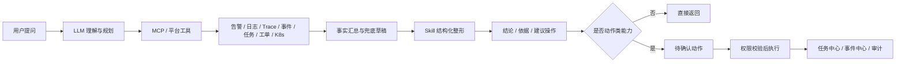
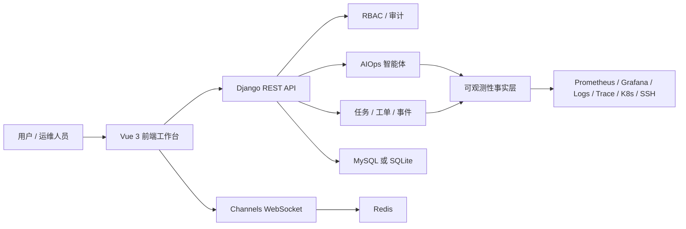

# SxDevOps

SxDevOps 是一个面向真实运维现场的开源智能运维 Agent 平台。它把 **可观测性、事件中心、任务中心、工单审批、容器管理、RBAC** 等平台能力组织成 Agent 可调用、可审计、可确认的运维工作流。

项目不是简单做一个聊天框，而是希望让运维从“到处查系统”升级为：

> 看态势、找证据、问系统、确认动作。

- 在线体验：[https://www.sxdevops.top](https://www.sxdevops.top)
- 产品介绍页：[SxDevOps AI Agent](https://www.sxdevops.top/ai-agent-promo)
- 技术栈：`Django + Django REST framework + Channels + Vue 3 + Element Plus`
- 开源协议：[Apache License 2.0](LICENSE)


## 为什么需要它

传统运维现场里，信息和动作经常被拆散：

- 告警中心看到红点，但日志、Trace 和最近变更在别的系统里。
- 发布、审批、任务执行、失败结果和关键操作散落在不同页面，复盘成本高。
- 巡检、批量命令、脚本模板和主机权限脱节，动作入口不统一。
- 排障经验依赖个人记忆，结论难沉淀，下一次仍要重新查。

SxDevOps 的目标是把这些碎片化能力收敛成一条链路：**可观测性取证，事件中心复盘，任务中心行动，AIOps 负责理解、规划和结构化输出**。

## 产品定位

SxDevOps AI Agent = **可观测性 + 事件中心 + 任务中心 + AIOps**

| 层次 | 说明 |
| --- | --- |
| 可观测性事实层 | 聚合告警、指标、日志、Trace、Grafana 和系统态势，形成 Agent 可查询的证据来源。 |
| 事件中心 | 沉淀最终执行结果、关键写操作、失败定位线索和复盘上下文。 |
| 任务中心 | 承接主机巡检、批量命令、脚本模板、任务草稿、执行历史和计划任务。 |
| AIOps 智能体 | 使用 LLM 做理解与规划，使用 MCP 工具取数，使用 Skill 约束输出，使用后端完成权限、确认、执行和审计。 |

一句话理解：

**模型负责理解，平台负责边界；Agent 可以分析和生成草稿，但关键动作必须通过权限校验和人工确认。**

## 核心能力

| 模块 | 能力 |
| --- | --- |
| AIOps 智能体 | 自然语言排障、工具调用、二阶段回答、Skill 模板、Action 预检、待确认动作、模型调用审计 |
| 可观测性 | 平台总览、系统态势、指标查询、日志检索、链路追踪、Grafana 看板承接、数据源管理 |
| 事件中心 | 失败事件定位、关键操作沉淀、事件源接入、操作审计、按系统/环境/应用/时间过滤 |
| 任务中心 | 主机任务、批量命令、脚本模板、资源分组、任务草稿、执行历史、计划任务 |
| 工单系统 | 应用发布、审批流、SQL 审计、事务工单、变更留痕 |
| 容器管理 | Kubernetes 集群、工作负载、Pod 终端、ConfigMap / Secret、Docker 环境管理 |
| 权限与审计 | 后端 API、前端路由、菜单、按钮和 WebSocket 场景统一接入 RBAC |

## 典型场景

以“生产 order-center 异常分析”为例。

传统方式通常要人工切换多个系统：

1. 打开告警平台看 PromQL、标签和触发时间。
2. 到日志中心查错误关键字和上下文。
3. 到链路追踪定位慢调用和异常 Span。
4. 翻最近发布、任务、审批和事件记录。
5. 手工整理结论和下一步动作。

在 SxDevOps 里，可以让 Agent 串起这条链路：

1. 用户用自然语言发起分析。
2. Agent 选择告警、日志、Trace、事件中心、任务中心等工具。
3. 后端按白名单执行工具调用，并做 RBAC、参数清洗和超时控制。
4. 平台汇总结构化证据，Skill 输出结论、依据、风险和建议操作。
5. 如需巡检或命令执行，先生成任务草稿，用户确认后才进入任务中心。
6. 执行结果继续回写事件中心和审计链路。

## Agent 工作机制



当前实现遵循几个原则：

- 平台 API 是唯一执行边界，模型不能绕过后端直接操作资源。
- 只读查询可以直接返回事实，创建、修改、执行类动作必须先预检再确认。
- Skill 负责沉淀 SOP、证据清单、输出结构和安全边界。
- 前端展示权限只是体验优化，后端 RBAC 才是安全边界。
- 会话、工具调用、待确认动作、执行结果和关键事件都要留痕。

## 产品截图

### AI Agent


### 日志/链路排障取证


### 事件中心


### 任务资源与执行入口


更多截图保存在 [docs/screenshots](docs/screenshots)。

## 技术栈

| 层级 | 技术 |
| --- | --- |
| 后端 | Django、Django REST framework、Channels、Daphne |
| 前端 | Vue 3、Vue Router、Pinia、Element Plus、ECharts、Vite |
| 数据库 | 本地默认 SQLite，Docker Compose 默认 MySQL 8 |
| 缓存与实时通信 | Redis、Channels Redis |
| 外部集成 | Kubernetes API、Docker、SSH、Prometheus / Grafana、SkyWalking、Tempo、Jaeger、Zipkin、Loki / ELK / SLS |

## 架构概览



## 快速启动

### 方式一：Docker Compose

（注意目前此启动方式我还没来得及测试，可能还有问题，可以先用本地开发方式启动，或者让你的AI来优化下启动方式）
（等我今天晚上抽空测试完善下此启动方式后再把这两句删掉）
仓库内置应用、MySQL 和 Redis 编排，适合最快体验完整功能：

```bash
docker compose up -d --build
```

启动后访问：

- 平台入口：`http://localhost:8000`
- MySQL 和 Redis 由 Compose 内部网络提供

首次启动时容器会自动执行：

```bash
python manage.py migrate
python manage.py seed_data
python manage.py seed_templates
```

如需关闭初始化数据，可在 `docker-compose.yml` 中把 `SXDEVOPS_SEED_DATA` 或 `SXDEVOPS_SEED_TEMPLATES` 设置为 `0`。

### 方式二：本地开发

后端：

```bash
cd backend
pip install -r requirements.txt
python manage.py migrate
python manage.py seed_data
python manage.py seed_templates
python -m daphne -b 0.0.0.0 -p 8000 sxdevops.asgi:application
```

前端：

```bash
cd frontend
npm install
npm run dev
```

本地开发地址：

- 前端：`http://localhost:3000`
- 后端：`http://localhost:8000`

Windows 下也可以使用开发辅助脚本一键启动或停止前后端：

```powershell
.\tools\dev\start-dev.ps1
.\tools\dev\stop-dev.ps1
```

## 体验账号

执行初始化数据后可使用以下账号登录，默认密码均为：

```text
Admin@123456
```

常用账号：

- `admin`
- `ops_demo`
- `dev_demo`
- `audit_demo`
- `viewer_demo`

这些账号仅用于本地演示和开发环境。公开部署前请修改默认密码或禁用演示账号。

## 配置说明

后端支持通过环境变量或 `backend/config.json` 覆盖关键配置。需要本地 MySQL 或 Redis 时，可以参考 [backend/config.example.md](backend/config.example.md) 和 [backend/config.example.json](backend/config.example.json)。

常用环境变量：

```bash
DATABASE_ENGINE=mysql
MYSQL_HOST=mysql
MYSQL_PORT=3306
MYSQL_DATABASE=sxdevops
MYSQL_USER=sxdevops
MYSQL_PASSWORD=sxdevops_password
REDIS_URL=redis://redis:6379/0
CHANNEL_REDIS_URL=redis://redis:6379/1
SECRET_KEY=change-me
DEBUG=0
ALLOWED_HOSTS=localhost,127.0.0.1
CORS_ALLOW_ALL_ORIGINS=0
```

本地开发不配置数据库时会自动使用 `backend/db.sqlite3`；Docker Compose 默认使用 MySQL 与 Redis。

## 常用命令

```bash
# 后端测试
cd backend && python manage.py test

# 前端构建
cd frontend && npm run build

# 重新生成基础演示数据
cd backend && python manage.py seed_data

# 重新生成智能体与任务模板
cd backend && python manage.py seed_templates

# Docker Compose 停止服务
docker compose down
```

## 目录结构

```text
.
├── backend/                 # Django 后端项目
│   ├── sxdevops/            # 项目设置、ASGI/WSGI、路由入口
│   ├── aiops/               # AIOps 智能体、模型、工具、审计
│   ├── ops/                 # 运维任务、可观测性、发布、告警等
│   ├── eventwall/           # 事件中心
│   ├── rbac/                # 权限、角色、菜单与审计
│   └── ...                  # marketplace、sqlaudit、iac、multicloud 等模块
├── frontend/                # Vue 3 前端项目
│   └── src/
│       ├── views/           # 页面
│       ├── layout/          # 布局
│       ├── api/             # API 封装
│       ├── router/          # 路由
│       └── stores/          # Pinia 状态
├── docs/                    # 产品截图与设计文档
├── docker/                  # 容器入口脚本
├── tools/dev/               # Windows 本地开发辅助脚本
├── docker-compose.yml       # 本地容器化部署
└── Dockerfile               # 前后端一体镜像
```

## 设计文档与延伸阅读

- [SxDevOps AI Agent 产品介绍](https://www.sxdevops.top/ai-agent-promo)
- [微信公众号文章：7fPrmABj2Ot2VbgTLTr3Zw](https://mp.weixin.qq.com/s/7fPrmABj2Ot2VbgTLTr3Zw)
- [微信公众号文章：1fFcSliQ_Nw_HQvwmRxzJg](https://mp.weixin.qq.com/s/1fFcSliQ_Nw_HQvwmRxzJg)
- [AIOps 2.0 升级优化方案](docs/AIOps2.0升级优化方案.md)
- [AIOps 2.1 指标证据包设计](docs/AIOps2.1指标证据包设计.md)
- [AIOps 2.1.2 Action Handler 与上下文 Copilot 设计](docs/AIOps2.1.2-Action-Handler与上下文Copilot设计.md)
- [AIOps MCP + Skill 双阶段应答设计](docs/AIOps-MCP-Skill-双阶段应答设计.md)
- [AIOps 智能体实现说明](docs/AIOps智能体实现说明.md)

## 路线图

- 扩展告警处置、工单汇总、K8s 异常、任务生成等 Skill 模板族。
- 增强内置 MCP 和外部 MCP 的健康检查、工具发现、鉴权与超时诊断。
- 在只读诊断后继续接入审批、命令模板、Runbook 和任务编排。
- 建立更可信的事实链路：告警准、事件准、任务准、结果准。
- 将高频、低风险动作逐步纳入可确认、可回滚、可审计的自动化闭环。

## 贡献

欢迎提交 Issue、讨论需求、补充文档或贡献代码。开始前建议先阅读 [CONTRIBUTING.md](CONTRIBUTING.md)。

适合优先参与的方向：

- 完善部署文档、截图和演示数据。
- 补充 AIOps、可观测性、任务中心和 RBAC 的测试用例。
- 新增数据源、模型供应商、工具调用和运维 Skill。
- 优化前端工作台体验和移动端适配。

## 安全与生产部署提醒

- 生产环境请显式配置 `SECRET_KEY`、`DEBUG=0`、`ALLOWED_HOSTS`、数据库和 Redis。
- 不要提交真实云账号、数据库密码、Kubeconfig、SSH 密钥、Grafana Token、模型供应商 API Key 或其他生产凭据。
- 演示账号和默认密码只适合本地体验，公开服务请立即调整。
- 运行日志、SQLite 数据库、临时截图和本地配置不应进入版本库。
- 如发现安全问题，请参考 [SECURITY.md](SECURITY.md) 的方式反馈。

## 开源协议

SxDevOps 基于 [Apache License 2.0](LICENSE) 开源。分发或二次开发时请保留项目中的 [NOTICE](NOTICE) 文件。

## 特别说明

SxDevOps 目前是一个纯个人开源项目，UI 设计、架构设计、功能开发、测试验证和模型调用成本都主要来自个人业余时间与个人 Token 投入。受限于个人精力，项目现阶段一定还有不少不完善的地方，也难免存在 Bug，欢迎大家多提 Issue、建议和 PR，我会在能力范围内持续迭代。

如果这个项目、实现方式或产品思路对你有帮助，也欢迎小额打赏支持，帮我分担一点 Token 成本，也给后续继续迭代多一点动力。


最后特别鸣谢阿铭老师为本项目提供思路启发和大力宣传。如果你有 AIOps、大模型运维、自动化运维相关学习需求，可以通过阿铭老师的公开渠道添加微信咨询：[铭科智联 - 跟阿铭学大模型/AIOps](https://www.amingedu.com/)。
