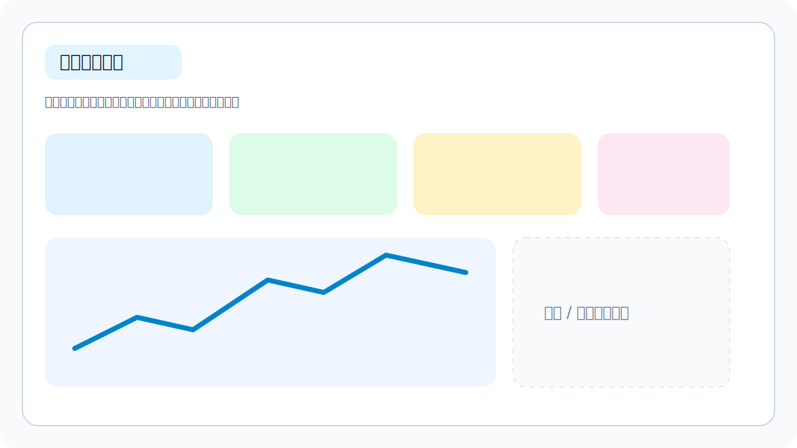
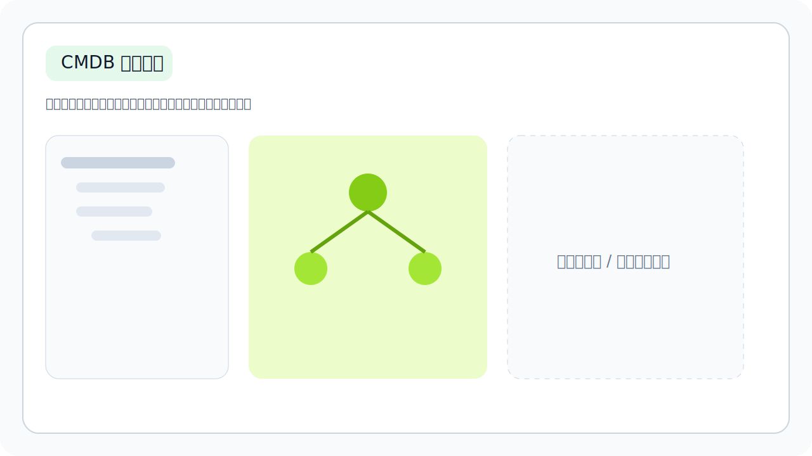
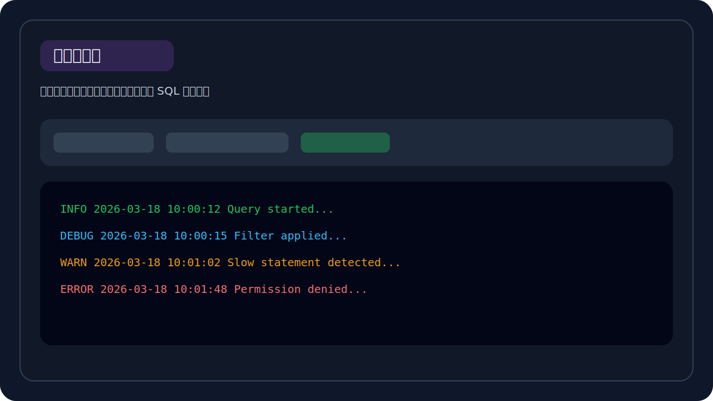
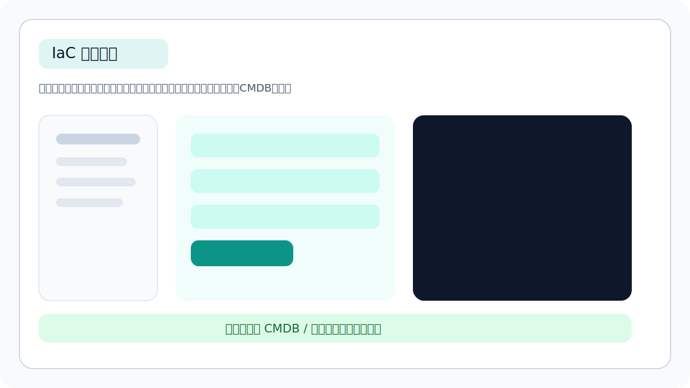

# AgDevOps 运维平台

AgDevOps 是一个基于 Django、Django REST framework、Channels、Vue 3 和 Element Plus 的一体化运维平台，覆盖主机管理、CMDB、部署管理、容器管理、Nginx 管理、日志中心、告警中心、SQL 审计，以及 IaC 资源编排等常见运维场景。

> 适合用于内部运维平台、云资源治理平台、交付演示环境，以及 DevOps / SRE 场景下的统一运维门户。

## 产品导览

如果你准备把这个仓库展示给团队、客户或面试官，README 首页建议重点展示下面 4 个页面：

| 页面 | 建议截图内容 | 展示重点 |
| --- | --- | --- |
| 仪表盘 | 首页总览卡片、趋势图、告警摘要 | 体现平台化与可视化能力 |
| CMDB | 资源树、配置项列表、拓扑或资源详情 | 体现资源治理与资产沉淀能力 |
| 日志中心 / SQL 审计 | 查询条件、结果列表、审计记录 | 体现运维排障与审计能力 |
| IaC资源编排 | 方案列表、方案设计、配置预览、执行与同步CMDB | 体现交付自动化与基础设施编排能力 |

### 平台首页总览



平台首页总览：统一展示主机、部署、日志、告警等核心运维指标。

### CMDB 资产治理



CMDB 资产治理：通过资源树、配置项和关系建模实现基础设施资产沉淀。

### 日志与审计



日志与审计：支持日志检索、SQL 审计与问题排查。

### IaC 资源编排



IaC 资源编排：按模块设计云资源，生成 Terraform 配置并联动执行、同步 CMDB。

### README 首页截图说明文案

如果你后续补截图，建议直接按下面这套文案放在图片下方：

1. `平台首页总览`：统一展示主机、部署、日志、告警等核心运维指标
2. `CMDB 资产治理`：通过资源树、配置项和关系建模实现基础设施资产沉淀
3. `日志与审计`：支持日志检索、SQL 审计与问题排查
4. `IaC 资源编排`：按模块设计云资源，生成 Terraform 配置并联动执行、同步 CMDB

### 推荐截图命名

如果你后续准备把截图正式放进仓库，建议统一放到 `docs/screenshots/`，命名如下：

- `docs/screenshots/dashboard.svg`
- `docs/screenshots/cmdb.svg`
- `docs/screenshots/logs-or-sql.svg`
- `docs/screenshots/iac-orchestration.svg`

## 核心能力

- 仪表盘：汇总主机、部署、日志、告警等关键指标
- 主机管理：主机纳管、连通性测试、WebShell 终端
- CMDB：CI 类型、配置项、资源树、资源拓扑、成本分析、资源申请
- 部署管理：部署记录、状态跟踪、发布过程查询
- 容器管理：K8s 集群、Docker 环境、容器与镜像查看
- Nginx 管理：环境、证书、域名、路由与配置发布
- 日志中心：日志源管理、日志查询、收藏条件、趋势图
- SQL 审计：数据源、SQL 工单、只读查询
- 工具市场：运维工具能力扩展入口
- IaC 资源编排：按模块配置云资源，生成 Terraform 工程，支持执行记录与同步 CMDB

## IaC 资源编排

当前已支持阿里云和华为云两类云厂商的 Terraform 资源编排。

### 当前支持的编排能力

- 基础信息：方案名称、描述、云厂商、区域、可用区
- 网络：VPC、子网、开放端口
- 服务器：支持配置多台服务器
- 数据库：RDS、Redis 独立标签页按需启用
- 网络附加资源：SLB / ELB、NAT 网关按需启用
- 对象存储：支持创建多个 Bucket
- 配置预览：可直接编辑生成后的 Terraform 文件内容
- 执行与同步 CMDB：支持 `init / plan / apply / destroy` 与资源回写

### 页面使用建议

推荐使用顺序如下：

1. 在“方案列表”中打开已有方案，或点击右上角“新建方案”
2. 在“方案设计”中完成各模块参数填写
3. 点击“生成配置并预览”查看 Terraform 文件
4. 在“配置预览”中确认内容并保存方案
5. 在“执行与同步CMDB”中执行 Terraform 或同步到 CMDB

## RBAC 权限体系

项目内置统一 RBAC 权限模型，新增功能也应遵循同一套约束。

- 模型：用户、用户组、角色、权限字典
- 后端：统一在 `backend/rbac/registry.py` 注册权限，在 `backend/rbac/permissions.py` 做接口校验
- 前端：路由、侧边栏、页面按钮、敏感操作统一接入 `frontend/src/stores/auth.js`
- WebSocket / WebShell：服务端二次校验，不依赖前端隐藏

### 已覆盖的权限范围

- 用户 / 用户组 / 角色 / 权限字典管理
- 主机、终端、部署、告警、日志、SQL 审计、服务市场
- CMDB、K8s、Docker、Nginx、IaC 的页面级与按钮级权限控制

### 演示账号

执行 `cd backend && python manage.py seed_data` 后，会自动补齐 RBAC 演示数据。默认密码均为 `Admin@123456`。

- `admin`
- `ops_demo`
- `dev_demo`
- `audit_demo`
- `viewer_demo`

## 快速启动

### 1. 启动后端

```bash
cd backend
pip install -r requirements.txt
python manage.py migrate
python manage.py seed_data
python -m daphne -b 0.0.0.0 -p 8000 agdevops.asgi:application
```

后端默认地址：`http://localhost:8000`

### 2. 启动前端

```bash
cd frontend
npm install
npm run dev
```

前端默认地址：`http://localhost:3000`

## 常用命令

```bash
# 后端测试
cd backend && python manage.py test

# 初始化或刷新演示数据
cd backend && python manage.py seed_data

# 前端开发
cd frontend && npm run dev

# 前端构建
cd frontend && npm run build

# 前端预览
cd frontend && npm run preview
```

## 项目结构

```text
agdevops/
|- backend/
|  |- agdevops/                  # Django 配置
|  |- ops/                       # 仪表盘、主机、部署、日志、告警
|  |- cmdb/                      # CMDB、拓扑、成本、资源申请
|  |- marketplace/               # 工具市场
|  |- rbac/                      # RBAC 权限系统
|  |- sqlaudit/                  # SQL 审计
|  |- iac/                       # Terraform IaC 编排与执行
|  |- requirements.txt
|  `- manage.py
|- frontend/
|  |- src/api/                   # 前端 API 封装
|  |- src/components/            # 复用组件
|  |- src/layout/                # 布局与菜单
|  |- src/router/                # 路由配置
|  |- src/stores/                # Pinia store
|  `- src/views/                 # 页面视图
|- docs/
|  `- screenshots/              # README 首页截图与占位图
`- README.md
```

## 开发说明

- 当前默认配置面向本地开发：`DEBUG = True`、SQLite、开放 CORS
- `frontend/dist/`、`frontend/node_modules/`、`backend/__pycache__/`、`db.sqlite3` 为生成产物，不建议提交
- 使用 Daphne 运行后端时，修改 Python 代码后需要手动重启服务
- 涉及 UI 变更时，建议至少执行一次 `cd frontend && npm run build`
- 涉及后端逻辑变更时，建议至少执行一次 `cd backend && python manage.py test`

## License

MIT
