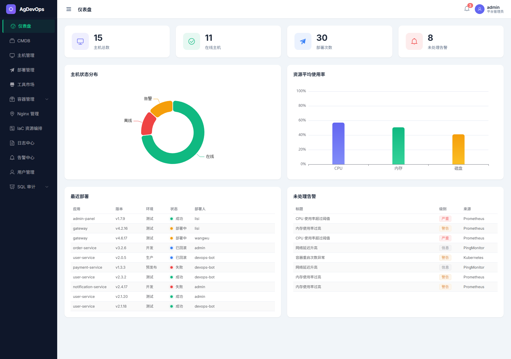
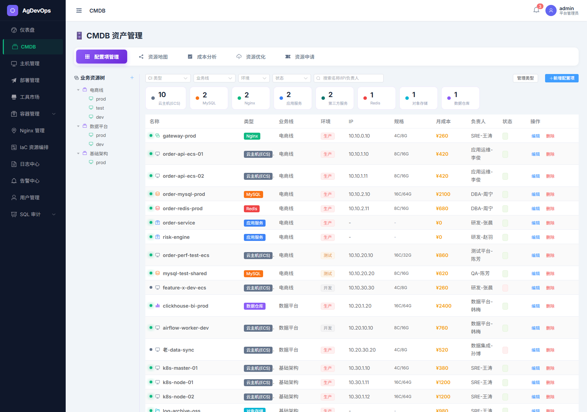
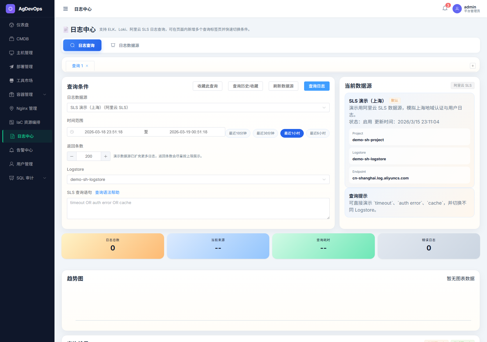
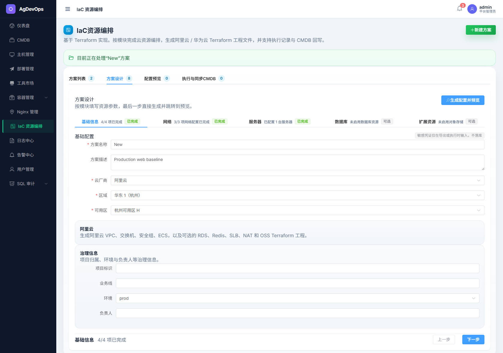

# AgDevOps 运维与平台工程演示项目

AgDevOps 是一个基于 `Django + Django REST framework + Channels + Vue 3 + Element Plus` 的平台工程与运维一体化演示项目，覆盖 **CMDB、应用发布、容器运维、日志与可观测性、SQL 审计、工具市场、IaC 资源编排** 等核心场景。

这个仓库不是单页 Demo，也不是纯 CRUD 后台。它把资源治理、变更执行、排障分析和权限控制串成了一条完整闭环，适合用于：

- 企业内部运维门户原型
- 平台工程 / DevOps / SRE 能力演示
- 交付、售前、汇报场景展示
- 个人求职作品集或全栈工程项目样例

## 项目亮点

- **CMDB 基座**：统一管理资源树、配置项、主机资产、资源拓扑、成本分析与资源优化。
- **应用发布闭环**：支持自研应用发布单、审批流、Docker / K8s 双模式部署、灰度 / 批次、回滚、重新执行，并自动回写 CMDB 关系。
- **可观测性平台**：新增统一的 `可观测性平台` 菜单，将日志中心、告警中心、链路追踪、Grafana 大屏聚合到一个入口下。
- **链路追踪已接入 SkyWalking**：支持 SkyWalking OAP GraphQL 查询，未配置或不可达时自动回落到演示数据。
- **日志与告警联动**：日志中心支持查询收藏、历史记录、趋势图；告警、日志、链路、Grafana 之间支持带条件联动跳转。
- **容器运维增强**：K8s 集群概览、Pod Terminal、工作负载扩缩容、配置回滚，Docker 容器与镜像治理。
- **工具市场双模式部署**：内置中间件与运行环境模板，可按 `Docker Compose 单机` 或 `Kubernetes` 部署。
- **IaC 编排**：支持按模块配置云资源，生成 Terraform 工程并同步 CMDB。
- **统一 RBAC**：权限注册、后端接口校验、前端路由与菜单可见性保持一致。

## 功能总览

### 1. 可观测性平台

可观测性平台是这次 README 更新的重点，当前包含：

- **平台总览**：统一展示日志、告警、Trace、Grafana 看板的摘要、入口和最近活动。
- **日志中心**：页内 Tab 切换日志查询与日志数据源管理，支持 `ELK / Loki / 阿里云 SLS`。
- **告警中心**：支持级别、状态筛选，并可一键跳转日志、链路追踪和 Grafana 大屏做进一步排障。
- **链路追踪**：对接 SkyWalking，支持服务筛选、Trace 搜索、拓扑图、Span 详情、异常 Span 与慢调用聚焦。
- **Grafana 大屏**：支持推荐看板列表、筛选、分组浏览、嵌入和外链打开。

当前可观测性平台内部已经形成了常用排障链路：

`告警中心 -> 日志中心 -> 链路追踪 -> Grafana 大屏`

### 2. CMDB

- CI 类型与配置项管理
- 主机资产与主机申请
- 统一资源树
- 资源拓扑
- 成本分析
- 资源优化建议
- 主机连通性测试与 WebShell

### 3. 应用发布

- 自研应用发布单
- 审批流与发布状态跟踪
- Docker / K8s 双模式
- 标准发布、灰度发布、批次发布
- 回滚、重新执行、下线
- 发布后自动建立 CMDB 关系

### 4. 容器与中间件运维

- Kubernetes 集群概览
- Pod 日志、事件、YAML 与浏览器内 Pod Terminal
- ConfigMap / Secret 在线编辑、Diff 预览与回滚
- Docker 容器启停、日志、Inspect、镜像治理
- Nginx 环境、域名、证书与配置发布

### 5. 工具市场

执行 `python manage.py seed_templates` 后，内置模板包括：

- MySQL
- Redis
- PostgreSQL
- MongoDB
- Nginx
- Jenkins
- GitLab
- Grafana
- Elasticsearch
- Loki
- JumpServer
- Nacos
- XXL-Job
- Java / Python / Go / Node.js 运行环境

这些模板支持直接选择部署模式，并用于演示双模式交付流程。

### 6. SQL 审计

- 多数据源管理
- SQL 工单
- 只读查询
- `MySQL`、`MongoDB`、`PolarDB` 支持
- RBAC 审批与查询控制

### 7. IaC 资源编排

- 云厂商、区域、可用区配置
- VPC、子网、开放端口
- ECS / 云主机编排
- RDS、Redis、SLB / ELB、NAT 网关、对象存储
- Terraform 文件预览与编辑
- `init / plan / apply / destroy`
- 同步 CMDB

## README 展示截图

README 当前使用以下页面截图：

| 页面 | 截图文件 | 用途 |
| --- | --- | --- |
| 仪表盘 | `docs/screenshots/dashboard.png` | 展示首页整体运营视角 |
| CMDB | `docs/screenshots/cmdb.png` | 展示资源树、配置项和治理能力 |
| 日志 / SQL | `docs/screenshots/logs-or-sql.png` | 展示日志中心与审计排障能力 |
| IaC 编排 | `docs/screenshots/iac-orchestration.png` | 展示 Terraform 方案设计与执行 |
| K8s Pod Terminal | `docs/screenshots/k8s-pod-terminal.png` | 展示浏览器内实时终端能力 |

### 仪表盘



用于展示平台首页的核心指标、摘要卡片与关键入口。

### CMDB



用于展示 CMDB 的资源树、配置项管理和资源治理能力。

### 日志 / SQL



用于展示日志中心与 SQL 审计的查询能力。当前 README 对这一页的定位已经扩展为“可观测性排障入口”，与新的可观测性平台能力保持一致。

### IaC 编排



用于展示 Terraform 方案设计、预览、执行与 CMDB 同步流程。

### K8s Pod Terminal


用于展示浏览器内 Pod Shell、实时终端交互和 RBAC 控制能力。

## 技术架构

- **后端**：`Django` + `Django REST framework` + `Channels`
- **前端**：`Vue 3` + `Pinia` + `Vue Router` + `Element Plus`
- **实时能力**：WebSocket 用于 Pod Terminal、WebShell 等场景
- **执行能力**：SSH、Docker Compose、Kubernetes Python Client、Terraform
- **数据库**：默认本地开发使用 `SQLite`

## RBAC 权限体系

项目内置统一 RBAC 权限模型，新增功能遵循同一套约束：

- 权限统一注册在 `backend/rbac/registry.py`
- 后端接口统一做权限校验
- 前端路由、侧边栏和页面操作按钮基于权限动态收敛
- WebSocket 场景在服务端做二次校验

本次新增的可观测性能力也已经纳入 RBAC：

- `ops.trace.view`
- `ops.grafana.view`

## 典型使用场景

- **企业内部运维门户**：统一承载资产、发布、日志、告警、链路和审计能力
- **平台工程演示项目**：展示资源治理、变更执行、排障链路和 IaC 的完整闭环
- **交付 / 售前演示环境**：通过真实页面快速说明平台化建设思路
- **求职作品集项目**：突出全栈工程能力、运维场景理解与产品化思维

## 快速启动

### 1. 启动后端

```bash
cd backend
pip install -r requirements.txt
python manage.py migrate
python manage.py seed_data
python manage.py seed_templates
python -m daphne -b 0.0.0.0 -p 8000 agdevops.asgi:application
```

后端默认地址：`http://localhost:8000`

### 2. 启动前端

```bash
cd frontend
npm install
npm run dev
```

前端默认地址：`http://localhost:3000`

### 3. 常用演示账号

执行 `python manage.py seed_data` 后会自动补齐演示数据。默认密码均为：

`Admin@123456`

可使用的演示账号包括：

- `admin`
- `ops_demo`
- `dev_demo`
- `audit_demo`
- `viewer_demo`

## 常用命令

```bash
# 后端测试
cd backend && python manage.py test

# 前端构建
cd frontend && npm run build

# 重新生成工具市场模板
cd backend && python manage.py seed_templates

# 重新生成演示数据
cd backend && python manage.py seed_data
```

## 相关文档

- `docs/应用发布执行逻辑与时序图.md`
- `docs/应用发布执行逻辑-汇报版.md`
- `docs/工具市场部署模式.md`
- `docs/screenshots/README.md`

## 适合怎么介绍这个项目

如果要在面试、汇报或路演中介绍这个仓库，可以按下面的顺序展开：

1. 这是一个面向企业内部的统一运维与平台工程演示平台。
2. 核心闭环是 `CMDB -> 变更执行 -> 可观测性排障 -> IaC 资源交付`。
3. 项目不是纯 CRUD，包含审批流、K8s API、SSH 执行、WebSocket 交互和 CMDB 联动。
4. 新增的可观测性平台把日志、告警、链路追踪和 Grafana 大屏收拢到了一个统一入口下，更适合做真实运维场景演示。
