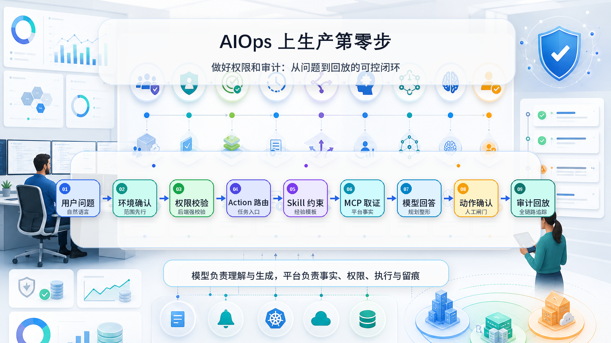

# AIOps 上生产第零步：先做好权限和审计



很多人聊 AIOps，第一反应往往是模型选型、Agent 编排、MCP 工具、自愈执行。但如果真的要把 AIOps 放进生产运维平台里，我觉得第零步不是让智能体“更聪明”，而是先让它“可控、可查、可追溯”。

因为智能体和传统功能不一样。传统平台里，用户点了哪个按钮、提交了哪个表单、执行了哪个任务，链路比较清晰。但智能体只需要用户输入一句自然语言，背后就可能发生环境识别、权限判断、Action 路由、Skill 加载、MCP 工具调用、模型规划、回答整形，甚至生成待执行任务草稿。

如果这些过程没有审计，智能体越强，风险越大。

所以我在做 SxDevOps AIOps 智能体时，没有只关注“它能不能回答问题”，而是先把权限和审计作为基础能力来设计。我的目标很简单：每一次问答，都能回答清楚几个问题：谁问的？问的是哪个环境？它查了什么？用了哪些工具？模型调用消耗了多少？有没有生成动作？动作有没有确认？出了问题能不能回放？

## 审计不是一张日志表

我没有把智能体审计简单做成“聊天记录列表”，而是拆成几层来看。

第一层是会话历史。这里记录每个用户的智能体会话，包括会话标题、用户、消息数、工具调用数、状态和最后消息时间。它解决的是最基础的问题：谁在什么时间使用了智能体，以及这次会话大概发生了什么。

第二层是调用审计。我把调用审计继续拆成 Action 命中、Skill 命中和 MCP 工具调用。Action 负责识别这次问题属于什么任务入口，比如告警分析、日志查询、K8s 排障、发布失败诊断、任务生成等。Skill 负责约束智能体的经验和输出结构，比如告警证据怎么组织、K8s 排障应该看哪些字段、自愈建议必须说明哪些风险。MCP 工具调用则记录智能体实际查了哪些平台数据，包括请求参数、响应摘要、调用状态和耗时。

这样做的好处是，智能体不是一个黑盒。用户看到的是一段回答，但平台能看到它背后的路由、取证和执行过程。

第三层是模型调用审计。每次模型请求都会记录模型提供商、调用用途、请求模型、实际模型、状态、输入 Token、输出 Token、总 Token、耗时和预估费用。这样既能排查“为什么这次回答慢”，也能统计“最近模型消耗主要花在哪些场景”。

第四层是待执行动作审计。我的原则是：分析可以自动，执行必须受控。智能体可以生成任务草稿，但不能绕过确认直接执行高风险动作。待执行动作会记录风险等级、状态、确认人、执行结果和关联任务，状态覆盖待确认、已确认、已执行、执行失败、已取消等。

## 权限要在后端兜住

AIOps 接入的是运维平台真实数据，不能只靠前端隐藏按钮。

所以我把能力拆成多个权限点：能不能进入智能体，能不能发起分析，能不能生成任务，能不能执行任务，能不能查看审计，能不能管理配置，能不能调用 MCP 工具。

工具层也要做权限校验。比如查主机要有主机查看权限，查日志要有日志权限，查告警要有告警权限，生成任务要有任务生成权限，执行任务还要有执行权限。

前端隐藏入口只是体验优化，真正的边界必须由后端来拦截。否则用户只要绕过页面直接调接口，权限体系就失效了。

## 环境必须前置确认

运维问题天然离不开环境。同样一句“order-center 最近有没有异常”，在生产、测试、灰度环境里含义完全不同。

所以我把环境确认放在问答链路最前面。用户没有指定环境时，智能体会提示必须先选择知识图谱环境；如果一句话命中了多个环境，就要求用户确认唯一环境；如果用户选择了自己无权限访问的环境，则直接拦截，不进入后续问答，也不会触发工具调用。

这点很关键。AIOps 不是普通聊天机器人，它后面连着告警、日志、链路、K8s、资源底座和任务中心。环境边界不清楚，就很容易发生越权查询或误分析。

## Action 和 Skill 是安全边界的一部分

我把自然语言先路由到 Action，而不是让模型自由决定所有事情。Action 会定义这次任务的类型、风险等级、需要的上下文、允许调用的工具、是否需要确认。

Skill 则负责把经验固化下来。比如自愈建议不能只给一句“建议重启”，而要说明适用范围、风险、回滚方式和是否需要人工确认。这样智能体的回答不是完全靠模型临场发挥，而是受平台规则和运维经验共同约束。

这些命中记录都会进入审计。后续如果某次回答不符合预期，可以反查是 Action 没路由对，还是 Skill 没命中，还是工具结果本身不完整。

## Token 和上下文也要有限制

这块不复杂，但必须有。

模型提供商里配置最大 Token，避免单次调用成本失控；智能体配置里限制最大历史消息数量，避免把过多历史上下文塞进模型，导致成本上升、速度变慢，甚至干扰当前问题判断。

AIOps 一旦多人使用，Token、上下文和模型费用就不只是技术细节，而是平台治理的一部分。

## 最后

我理解的 AIOps 上生产，不是接一个模型，也不是做一个聊天框，而是形成一条可控链路：

```text
用户问题 -> 环境确认 -> 权限校验 -> Action 路由 -> Skill 约束 -> MCP 取证 -> 模型回答 -> 动作确认 -> 审计回放
```

模型负责理解和生成，平台负责事实、权限、执行和留痕。

只有先回答清楚“谁能问、能查什么、查了什么、准备做什么、出了问题能不能回放”，AIOps 才能从一个演示型助手，变成真正能进入生产运维体系的智能入口。
