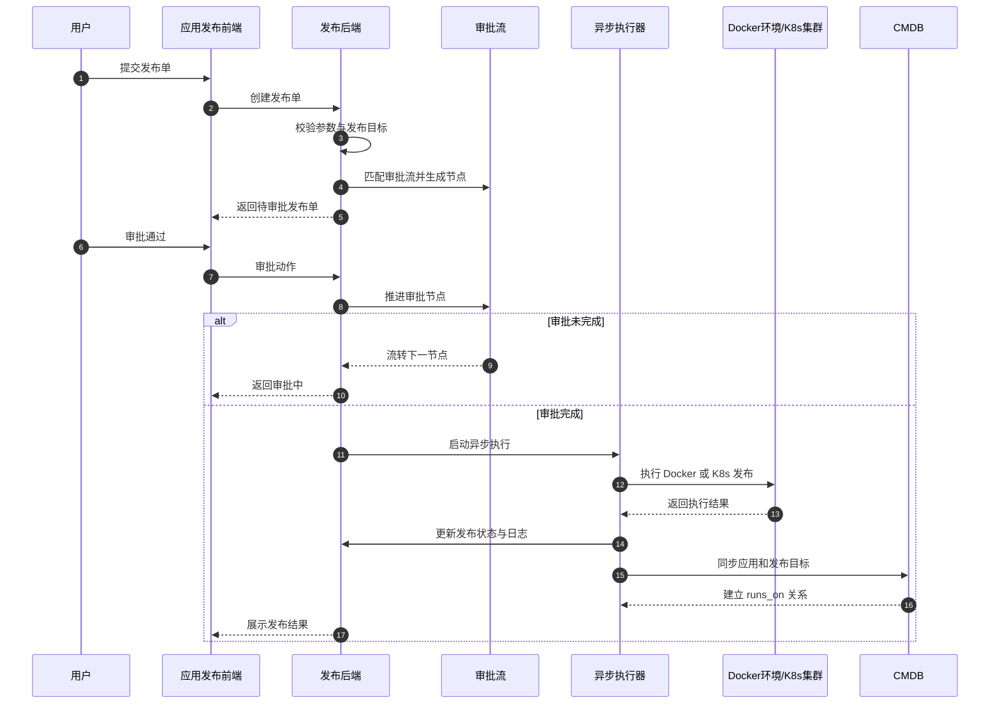

# 应用发布执行逻辑（汇报版）

## 一句话概括

`应用发布` 是面向公司自研应用的企业发布能力，支持：

- Docker 环境发布
- K8s 集群发布
- 审批流
- 状态查看
- 回滚
- 重新执行
- 灰度 / 批次发布流程
- 自动同步 CMDB

---

## 价值定位

和 `工具市场` 不同，`应用发布` 不是部署中间件模板，而是服务于公司业务应用交付：

- `工具市场`：偏中间件、开源组件、模板化部署
- `应用发布`：偏业务应用、版本发布、审批管控、变更留痕

适合用于：

- 测试环境发版
- 生产环境变更审批
- 版本回滚
- 企业内部发布平台演示

---

## 当前实现方式

### 1）Docker 环境发布

实现方式是：

- 后端通过 `SSH` 连接目标 Docker 环境
- 动态生成 `docker-compose.yml`
- 上传到目标机器
- 执行 `docker-compose up -d`

可理解为：

> `SSH + docker-compose`

### 2）K8s 集群发布

实现方式是：

- 后端读取集群 `kubeconfig`
- 动态生成 `Deployment / Service`
- 自动检查并创建 namespace
- 调用 Kubernetes Python Client 下发资源

可理解为：

> `kubeconfig + Kubernetes API`

---

## 标准发布流程

发布链路大致分 4 步：

### 第 1 步：提交发布单

用户填写：

- 应用
- 版本
- 镜像
- 业务线
- 环境
- 发布目标
- 发布策略

系统会先校验：

- 业务线和环境是否与 CMDB 对齐
- Docker / K8s 目标是否合法
- 发布参数是否完整

### 第 2 步：走审批流

系统会按环境自动匹配审批流，并生成审批节点。

只有所有审批节点通过后，发布单才会进入执行阶段。

### 第 3 步：异步执行发布

审批通过后，后端启动后台线程异步执行：

- Docker → SSH 到目标环境执行 Compose 发布
- K8s → 连接集群创建资源

### 第 4 步：回写状态并同步 CMDB

执行完成后，系统会自动：

- 更新发布状态
- 记录发布日志
- 标记当前生效版本
- 在 CMDB 中生成/更新应用与目标配置项
- 建立 `runs_on` 关系

---

## 企业发布平台能力

当前已经具备企业发布平台的核心雏形：

- **审批管控**：支持多节点审批流
- **发布留痕**：每次发布、回滚、重试都有独立记录
- **版本治理**：支持当前生效版本识别
- **发布追踪**：支持运行状态查看
- **回滚能力**：按最近成功版本生成回滚单
- **批次能力**：支持推进批次
- **灰度能力**：已支持灰度发布单模型与流程演示
- **CMDB 关联**：发布后自动登记到 CMDB

---

## 当前边界

从平台能力看，当前实现已经足够支撑：

- 内部演示
- 企业发布平台原型
- 测试 / 预发 / 生产审批式发版

但如果要进一步走向更完整的生产级发布平台，还可以继续增强：

- 真正的灰度流量切分（Istio / Ingress）
- 自动回滚策略
- 实时日志流
- 发布成功率 / 失败率报表
- 与外部流水线平台联动

---

## 汇报用时序图

---

## 相关文档

- 详细版：`docs/应用发布执行逻辑与时序图.md`
- 本文档：`docs/应用发布执行逻辑-汇报版.md`

