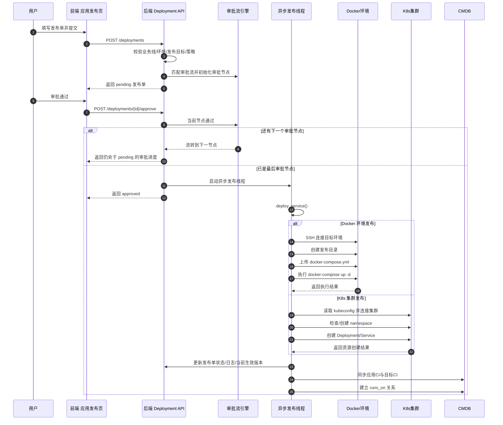
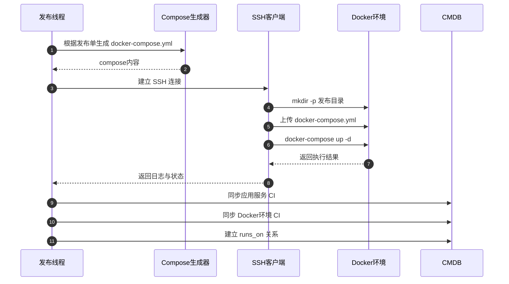
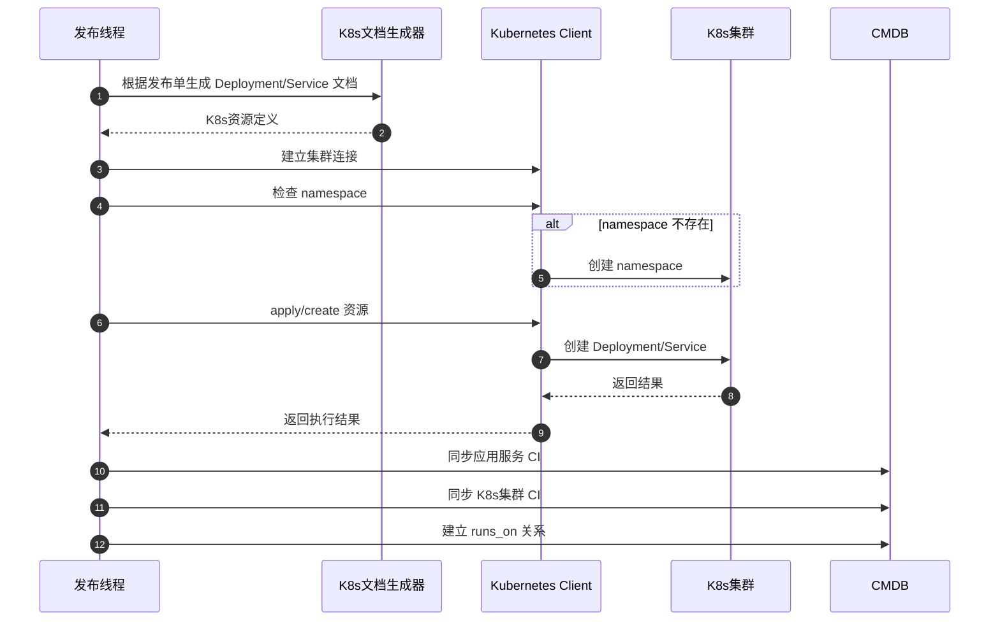

# 应用发布执行逻辑与时序图

## 1. 功能定位

`应用发布` 用于发布公司自研应用，和 `工具市场` 是两套独立能力：

- `工具市场`：偏中间件、开源组件的模板化部署
- `应用发布`：偏公司业务应用的发布、审批、回滚、重试、状态查看与 CMDB 联动

当前系统里的 `应用发布` **不是对接外部 CI/CD 平台**，而是由 AgDevOps 后端直接执行发布动作。

---

## 2. 两种发布模式的实现方式

### 2.1 Docker 环境发布

Docker 模式下，发布单关联的是 `Docker 环境管理` 里的环境记录，而不是普通主机列表。

实现方式：

1. 后端根据发布单内容动态生成 `docker-compose.yml`
2. 通过 SSH 连接目标 Docker 环境
3. 在目标机创建发布目录
4. 上传 `docker-compose.yml`
5. 执行：

```bash
docker-compose up -d
```

或：

```bash
docker compose up -d
```

本质上是：

- `SSH + docker-compose`

---

### 2.2 K8s 集群发布

K8s 模式下，发布单关联的是 `K8sCluster` 集群配置。

实现方式：

1. 后端根据发布单动态生成 K8s 资源定义
2. 自动检查命名空间是否存在
3. 如果命名空间不存在则自动创建
4. 使用 Kubernetes Python Client 将资源提交到集群

当前核心生成资源包括：

- `Deployment`
- `Service`（当配置了服务端口时）

本质上是：

- `kubeconfig + Kubernetes Python Client`

---

## 3. 发布主链路说明

### 3.1 新建发布单

用户在前端填写：

- 应用名
- 版本
- 镜像
- 业务线
- 环境
- 发布模式
- Docker 环境 / K8s 集群
- 发布策略
- 变更说明

后端收到请求后会做这些事：

1. 校验业务线、环境是否和 CMDB 资源树对齐
2. 校验 Docker / K8s 目标是否合法
3. 校验灰度、批次等策略参数
4. 保存发布单，初始状态通常为：
   - `approval_status = pending`
   - `status = pending`
5. 自动匹配审批流并生成审批节点

---

### 3.2 审批流处理

审批流按环境匹配：

- 优先匹配当前环境启用中的审批流
- 如果没有，则尝试匹配“全部环境”审批流

审批通过逻辑：

1. 当前审批节点通过
2. 若还有下一个节点，则流转到下一个节点
3. 若已是最后一个节点，则整单审批通过
4. 审批通过后，后端启动异步发布线程

驳回逻辑：

1. 当前审批节点记为拒绝
2. 发布单整体记为 `rejected`
3. 不进入执行阶段

---

### 3.3 异步执行

审批通过后，系统不会阻塞接口等待发布完成，而是：

1. 启动后台线程
2. 后台线程统一进入 `deploy_service`
3. 根据 `deploy_mode` 分发到不同执行器：
   - Docker → `_deploy_docker_compose`
   - K8s → `_deploy_k8s`

---

## 4. Docker 与 K8s 的详细执行逻辑

### 4.1 Docker 执行逻辑

执行步骤：

1. 解析目标 Docker 环境
2. 生成发布名与发布目录
3. 生成 Compose 内容
4. SSH 连接目标环境
5. 创建目录
6. 上传 `docker-compose.yml`
7. 执行 `docker-compose up -d`
8. 记录发布日志
9. 标记当前生效版本
10. 同步 CMDB

运行状态获取方式：

1. SSH 到目标 Docker 环境
2. 执行 `docker compose ps --all --format json`
3. 解析容器状态并返回给前端

停止 / 启动 / 下线：

- 停止：`docker-compose stop`
- 启动：`docker-compose start`
- 下线：`docker-compose down -v`

---

### 4.2 K8s 执行逻辑

执行步骤：

1. 解析目标集群、命名空间、发布名称
2. 构建 Deployment / Service YAML 结构
3. 检查命名空间是否存在
4. 不存在则创建 namespace
5. 调用 Kubernetes Client 提交资源
6. 记录发布日志
7. 标记当前生效版本
8. 同步 CMDB

运行状态获取方式：

1. 调用 K8s API 查询 Deployment
2. 查询相关 Pod
3. 汇总 ready/phase 等状态返回前端

停止 / 启动 / 下线：

- 停止：将副本数缩容到 0
- 启动：恢复副本数
- 下线：删除 Deployment / StatefulSet / Service 等关联资源

---

## 5. 回滚、重试、批次、灰度

### 5.1 重新执行

`重新执行` 不是重复跑同一条记录，而是：

- 基于原发布单复制生成一条新的发布单
- 新发布单重新走审批与执行链路

这样做的好处：

- 审计清晰
- 每次执行都有独立记录

---

### 5.2 回滚

`回滚` 的本质也是新建一条发布单：

1. 找到同一发布目标下最近一次成功版本
2. 用该版本内容生成新的回滚发布单
3. 新回滚单重新走审批与执行

---

### 5.3 批次发布

当前批次发布逻辑主要体现为：

- 发布单记录 `batch_total / batch_current / batch_size`
- 通过“推进批次”操作推进批次进度
- 系统记录批次推进日志

也就是说，当前已经具备：

- 批次发布单模型
- 批次推进动作
- 批次进度展示

---

### 5.4 灰度发布

当前灰度发布主要体现为：

- 灰度策略字段建模
- 灰度发布单流程
- 灰度比例记录与展示
- K8s 灰度 demo 数据

目前还没有深度接入：

- Istio VirtualService
- Nginx Ingress 权重路由
- 服务网格流量切分控制面

因此当前更准确地说是：

- **具备灰度发布流程模型与演示能力**
- **未完全实现真实生产级流量切分**

---

## 6. CMDB 联动逻辑

发布成功、停止、下线后，系统会自动同步到 CMDB。

同步内容分两类：

### 6.1 应用 CI

系统会生成或更新一个“应用服务”配置项，记录：

- 应用名
- 版本
- 镜像
- 发布模式
- 发布目标
- 命名空间
- 副本数
- 发布策略
- 当前发布目录

### 6.2 目标 CI

系统也会为发布目标生成或更新配置项：

- Docker 发布 → `Docker环境`
- K8s 发布 → `K8s集群`

并自动建立：

- `应用服务 --runs_on--> 发布目标`

这样 CMDB 里能看到：

- 哪个应用发布到了哪个目标
- 当前版本是什么
- 当前状态如何

---

## 7. 应用发布执行时序图

下面这张图描述的是“新建发布单 → 审批 → 执行 → 状态回写 → CMDB 同步”的整体链路。



---

## 8. Docker 与 K8s 分支时序图

### 8.1 Docker 发布时序图



### 8.2 K8s 发布时序图



---

## 9. 当前实现总结

当前应用发布已经具备：

- Docker 环境发布
- K8s 集群发布
- 审批流
- 执行状态查看
- 回滚
- 重新执行
- 批次发布推进
- 灰度发布流程建模
- CMDB 自动关联

当前仍可继续增强的方向：

- 接入真实流量灰度控制（Istio / Ingress）
- 将批次发布与实例粒度发布动作更深绑定
- 增加发布失败自动回滚策略
- 增加 WebSocket/实时日志流
- 增加发布审计报表与发布成功率分析

